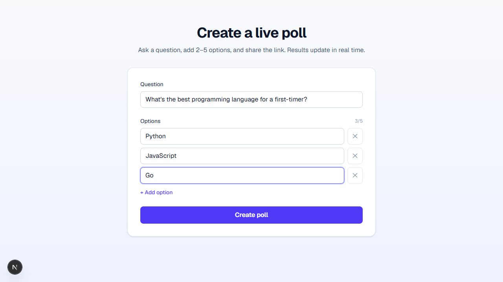
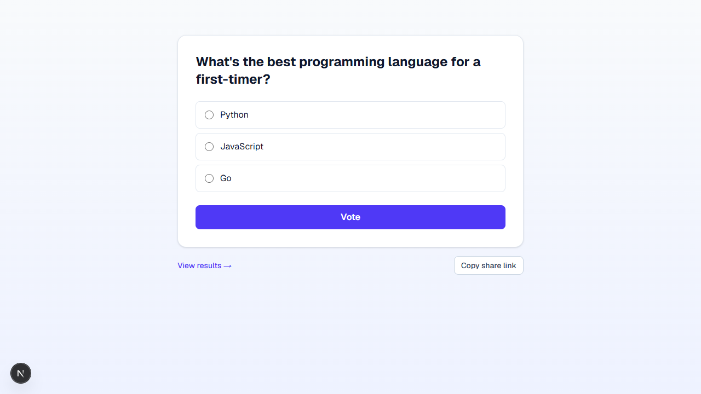
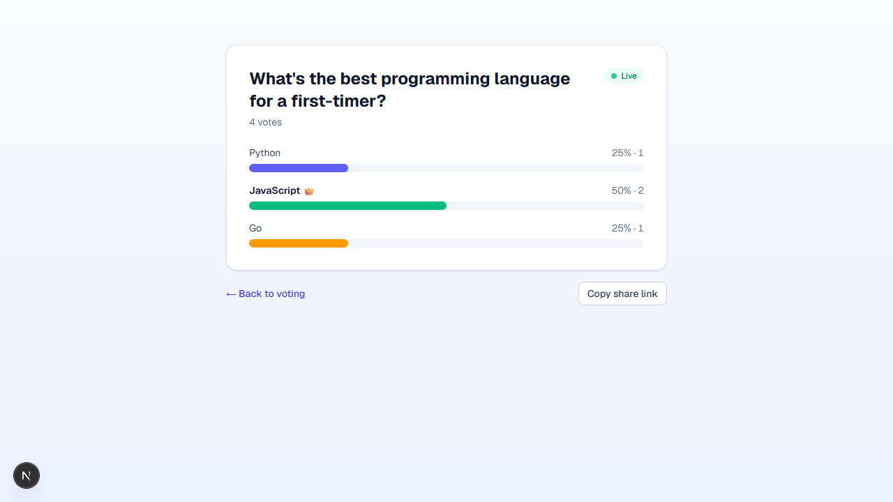

# 🗳️ Live Poll App

Create a poll, share the link, and watch the results update live.

**🔗 Live demo - https://live-poll-app-three.vercel.app**

A small full-stack voting app built with **Next.js 16 (App Router)**, **Prisma 7 + SQLite**, and **TypeScript**. The goal is clean, working software with sensible architecture, not feature bloat.

| Create | Vote | Live results |
|---|---|---|
|  |  |  |

---

## Features

**Core**
- Create a poll with a question and **2-5 options**
- Each poll gets a **unique, shareable URL** (`/poll/<id>`)
- Anyone with the link can **cast a vote**
- Results are shown as **animated bars** with percentages and a 👑 on the leader

**Extras**
- ⚡ **Live-updating results** via lightweight polling (no refresh needed)
- ✅ **Input validation** on both client and server (Zod)
- 🎨 **Visual polish** - clean card layout, copy-link button, loading/empty/"reconnecting" states
- 🚧 Light **double-vote guard** (per-browser, via `localStorage`)
- ☁️ **Deploy-ready** - swap the database URL to ship to the cloud (see [Deployment](#deployment))

**Out of scope** (by design): authentication, exhaustive tests, production-grade error handling, mobile-first design.

---

## Tech stack & why

| Layer | Choice | Why |
|---|---|---|
| Framework | **Next.js 16 (App Router)** | One project for UI **and** API (Route Handlers). TypeScript end-to-end, server components for fast first paint, trivial to deploy. |
| Language | **TypeScript (strict)** | Catch mistakes at compile time; the data model is typed from DB to UI. |
| Database | **SQLite** | Zero-config and file-based - the app runs locally with no DB server to install. Perfect for an MVP. |
| ORM | **Prisma 7** | Declarative schema, type-safe queries, real migrations. The schema *is* the data-model documentation. |
| DB driver | **libSQL adapter** (`@prisma/adapter-libsql`) | Talks to a local SQLite file **and** hosted libSQL/Turso with identical code - so the same app deploys to the cloud by changing one env var. |
| Validation | **Zod 4** | One schema validates the API request and feeds friendly client-side messages. |
| Styling | **Tailwind CSS 4** | Fast, consistent styling without a separate CSS pipeline. |

---

## Quick start

**Prerequisites:** Node.js **20.9+** and npm.

```bash
# 1. Install dependencies (also generates the Prisma client)
npm install

# 2. Create your local environment file
cp .env.example .env        # Windows PowerShell: copy .env.example .env

# 3. Create the SQLite database and apply migrations
npm run db:migrate

# 4. Start the dev server
npm run dev
```

Open **http://localhost:3000** and create your first poll.

> `.env` just needs `DATABASE_URL="file:./dev.db"` - already provided in `.env.example`.

**Handy scripts**

| Script | Does |
|---|---|
| `npm run dev` | Start the dev server (http://localhost:3000) |
| `npm run build` / `npm start` | Production build / serve |
| `npm run db:migrate` | Apply migrations (creates `dev.db`) |
| `npm run db:studio` | Open Prisma Studio to browse the data |
| `npm run db:reset` | Drop and recreate the local database |

---

## Project structure

```
app/
  page.tsx                     # "/"            - create a poll
  poll/[id]/page.tsx           # "/poll/:id"    - vote view (the shareable link)
  poll/[id]/results/page.tsx   # ".../results"  - live results view
  not-found.tsx                # 404 for unknown polls
  api/polls/route.ts                 # POST   create poll
  api/polls/[id]/route.ts            # GET    poll + live tallies
  api/polls/[id]/vote/route.ts       # POST   cast a vote
components/                     # CreatePollForm, VoteForm, Results, CopyLinkButton
lib/
  prisma.ts                    # Prisma client singleton (libSQL adapter)
  validation.ts                # Zod schemas, shared by client & server
  results.ts                   # getPollResults() - tallies a poll
  types.ts                     # shared types
prisma/
  schema.prisma                # data model
  migrations/                  # versioned SQL migrations
```

Pages render and own layout, components handle interaction, and `lib/` holds data access and validation so each piece can be reasoned about in isolation.

---

## Data model

```prisma
model Poll {
  id        String   @id @default(cuid())   // the shareable id
  question  String
  createdAt DateTime @default(now())
  options   Option[]
  votes     Vote[]
}

model Option {
  id     String @id @default(cuid())
  text   String
  order  Int                                 // display order (0-based)
  pollId String
  poll   Poll   @relation(fields: [pollId], references: [id], onDelete: Cascade)
  votes  Vote[]
}

model Vote {
  id        String   @id @default(cuid())
  createdAt DateTime @default(now())
  optionId  String
  option    Option   @relation(fields: [optionId], references: [id], onDelete: Cascade)
  pollId    String                            // denormalized for fast per-poll queries
  poll      Poll     @relation(fields: [pollId], references: [id], onDelete: Cascade)
}
```

**Key decision - votes are append-only rows, not a counter.** Each vote is its own `Vote` row, and tallies are computed by counting rows. The alternative - a `count` column you increment - invites a classic lost-update race under concurrent voting (read 5 → read 5 → write 6 → write 6). Appending rows has no read-modify-write step, so concurrent votes can't clobber each other. It also keeps an audit trail (timestamps) for free.

IDs are **cuid** values so share links are non-sequential and not guessable-by-increment.

---

## API

All endpoints return JSON.

| Method | Route | Body | Result |
|---|---|---|---|
| `POST` | `/api/polls` | `{ question, options: string[] }` | `201 { id }` |
| `GET` | `/api/polls/:id` | - | `200` poll + options + vote counts |
| `POST` | `/api/polls/:id/vote` | `{ optionId }` | `201 { ok: true }` |

Validation returns `400` with field-level issues; unknown polls/options return `404`. Voting checks that the option actually belongs to the poll, so you can't vote across polls.

```bash
# Example
curl -X POST localhost:3000/api/polls -H "Content-Type: application/json" \
  -d '{"question":"Tabs or spaces?","options":["Tabs","Spaces"]}'
```

---

## How live updates work

The results view server-renders the current tallies, then a small client component polls `GET /api/polls/:id` every **2 seconds** and updates the bars. A "Live" badge flips to "Reconnecting..." if a request fails.

**Why polling over WebSockets/SSE?** For this scale it's the right amount of complexity: stateless, works on any host (including serverless), and trivial to reason about. WebSockets/SSE would cut latency and server load at higher scale - noted below.

---

## Scaling & concurrency

- **Concurrent votes** are safe by design - appending rows avoids the lost-update race a counter column would have. The database serializes the inserts.
- **Reads under load:** every results viewer polls every 2s. The tally query is a single indexed aggregate (`Vote` is indexed on `pollId`/`optionId`), but at high fan-out you'd:
  - cache tallies (e.g. in Redis) and/or push updates via **SSE/WebSockets** instead of per-client polling;
  - maintain a periodically-reconciled counter for O(1) reads while keeping raw votes as the source of truth.
- **Database:** SQLite handles an MVP comfortably. For real concurrency/scale, switch Prisma's datasource to **Postgres** or **hosted libSQL/Turso** - the schema and queries don't change.
- **Stateless app servers:** all state lives in the DB, so the Next.js app scales horizontally behind a load balancer.

---

## Deployment

**Live at [live-poll-app-three.vercel.app](https://live-poll-app-three.vercel.app)** - deployed on Vercel with a [Turso](https://turso.tech) (libSQL) database.

SQLite's local file doesn't persist on serverless platforms, so the hosted deployment points the **same code** at a hosted libSQL database:

1. Create a free database at [Turso](https://turso.tech) (libSQL).
2. Set env vars on your host (e.g. Vercel):
   ```
   DATABASE_URL="libsql://<your-db>.turso.io"
   DATABASE_AUTH_TOKEN="<token>"
   ```
3. Run `prisma migrate deploy` against it, and deploy.

No application code changes - only the connection string. (For Postgres instead, change the `provider` in `schema.prisma` and the adapter in `lib/prisma.ts`.)

---

## Trade-offs & what I'd add with more time

- **Tests.** I verified the full flow end-to-end (and the validation paths) manually, but didn't add an automated suite. With more time: API route tests (create → vote → tally) and a happy-path browser test.
- **Real vote dedup.** The double-vote guard is per-browser only. Real prevention needs identity (accounts) or at least IP/fingerprint heuristics - out of scope here.
- **Realtime.** Polling is simple and robust; SSE/WebSockets would be the next step for instant updates at scale.
- **Poll lifecycle.** Closing polls, expiry, editing, and an owner/admin view would be natural follow-ups.
